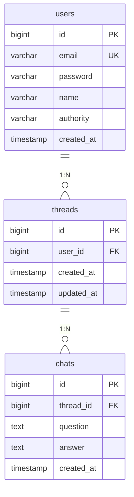

# kotlin-postgresql-ai-service

## 실행 방법
```bash
# 1. PostgreSQL 실행
docker-compose up -d

# 2. 애플리케이션 실행 (Mock AI)
./gradlew bootRun

# 3. 실제 OpenAI 연동
OPENAI_API_KEY=sk-xxx ./gradlew bootRun --args='--spring.profiles.active=prod'
```

## 기술 스택
- Kotlin 1.9.x / Spring Boot 3.4.x / PostgreSQL 15.8
- Spring Data JPA / Bean Validation
- OpenAI Chat Completions API (gpt-4o-mini)

## API 엔드포인트

| Method | Endpoint | 설명 |
|--------|----------|------|
| POST | /api/v1/users/signup | 회원가입 |
| POST | /api/v1/users/admin/signup | 관리자 가입 |
| POST | /api/v1/users/login | 로그인 |
| POST | /api/v1/chats?userId={id} | 대화 생성 (AI 응답) |
| GET | /api/v1/chats?userId={id} | 대화 목록 조회 (스레드 단위) |
| DELETE | /api/v1/threads/{id}?userId={id} | 스레드 삭제 |

## 설계 결정

### AiClient 인터페이스 분리
고객사가 "OpenAI는 알지만 API Spec에 대한 깊은 이해는 없다"고 했기 때문에,
AI Provider를 교체해도 비즈니스 로직에 영향이 없도록 인터페이스로 분리했습니다.
Profile 기반으로 Mock/Prod를 전환할 수 있어, 개발 환경에서는 API 키 없이도 동작합니다.

### 스레드 자동 관리
사용자가 스레드를 직접 생성하지 않고, 30분 규칙에 따라 자동으로 생성/유지됩니다.
마지막 질문으로부터 30분 이내면 기존 스레드에 이어서 대화하고,
30분이 지나면 새 스레드가 생성됩니다.

### 대화 히스토리 전달
스레드 내 기존 Q&A를 OpenAI messages 형식으로 변환하여 함께 전송합니다.
이를 통해 멀티턴 대화에서 맥락이 유지됩니다.

---

## 과제 분석 과정 (채점 기준 a)

과제 시나리오의 핵심을 세 가지로 파악했습니다.

1. **시연 목표: "API를 통해 AI를 활용할 수 있다"**
   → 대화(chat) 기능이 최우선. 실제 AI 응답이 돌아오는 것을 확인할 수 있어야 합니다.

2. **"지속적으로 확장 개발 가능해야 한다"**
   → AI Provider 인터페이스 분리, Profile 전환, 예외 처리 등 구조적 확장성에 집중했습니다.

3. **"향후 대외비 문서를 학습시키고 싶다"**
   → RAG는 미래 요구사항으로 판단하여 현재 구현에서는 제외하고, 확장 가능한 구조만 마련했습니다.

이를 기반으로 우선순위를 다음과 같이 설정했습니다:
- 1순위: 대화 관리 (시연 핵심)
- 2순위: 사용자 관리 (최소한의 식별)
- 3순위: 피드백 관리 (시간 부족으로 미구현)
- 4순위: 분석/보고 (시간 부족으로 미구현)

3시간이라는 제약 안에서 고객사에게 시연을 해야하는 상황을 고려해 "핵심을 확실하게"를 택했습니다.

**실제 대화 요청 및 대화 목록 실행 결과**
```
GET http://localhost:8080/api/v1/chats?userId=1&page=0&size=10&sort=createdAt,desc

HTTP/1.1 200 
Content-Type: application/json
Transfer-Encoding: chunked
Date: Fri, 13 Feb 2026 07:28:38 GMT

{
  "content": [
    {
      "threadId": 2,
      "chats": [
        {
          "threadId": 2,
          "question": "Dad Joke 한 번 시원하게 부탁드립니다.",
          "answer": "물론이죠! 여기 아재 개그 하나 드릴게요.\n\n왜 컴퓨터는 춤을 출 수 없을까요?\n\n바이러스에 감염될까봐요! 😄",
          "createdAt": "2026-02-13T16:27:23.57429"
        },
        {
          "threadId": 2,
          "question": "재밌네요 한 번 더 해주세요!",
          "answer": "좋아요! 또 하나 해볼게요.\n\n왜 농구공은 항상 기분이 좋을까요?\n\n항상 바운스가 있기 때문이죠! 🏀😄",
          "createdAt": "2026-02-13T16:28:00.387986"
        }
      ],
      "createdAt": "2026-02-13T16:27:22.111385"
    }
  ],
  "pageable": {
    "pageNumber": 0,
    "pageSize": 10,
    "sort": {
      "empty": false,
      "sorted": true,
      "unsorted": false
    },
    "offset": 0,
    "paged": true,
    "unpaged": false
  },
  "last": true,
  "totalElements": 1,
  "totalPages": 1,
  "first": true,
  "size": 10,
  "number": 0,
  "sort": {
    "empty": false,
    "sorted": true,
    "unsorted": false
  },
  "numberOfElements": 1,
  "empty": false
}
Response file saved.
> 2026-02-13T162838.200.json

Response code: 200; Time: 38ms (38 ms); Content length: 716 bytes (716 B)

```

## ERD



## AI 활용 방식 (채점 기준 b)

과제 진행 중 AI(Claude, ChatGPT)를 다음과 같이 활용했습니다:

- **Kotlin 문법 확인**: Java 경험은 있지만 Kotlin은 익숙하지 않아, data class, null safety, `@field:` 접두사 등 Kotlin 특유의 문법을 확인하는 데 활용했습니다.
- **OpenAI API 연동 코드 생성**: - **OpenAI API 연동 코드 생성**: AiClient 인터페이스, Mock/Prod 구현체, Properties 설정 등 구조 설계는 직접 수행하고, RestClient를 사용한 Chat Completions API 호출 코드와 JSON 파싱 로직은 AI에게 명세를 제공하여 생성을 맡겼습니다. 생성된 코드는 프로젝트 구조에 맞게 리뷰 후 수정했습니다.
- **보일러플레이트 가속**: DTO, Repository 메서드 시그니처 등 반복적인 코드 작성을 AI에게 위임하여 시간을 절약했습니다.
- **문서 초안 작성**

**어려웠던 점**:
- AI가 생성한 Kotlin 코드에서 Java 관습이 섞이는 경우가 있었습니다 (Optional 사용, var 남용 등). 이를 Kotlin 관용적 코드로 수정하는 데 추가 시간이 필요했습니다.
- 프로젝트 전체 맥락을 AI에게 전달하는 것이 어려워, 파일 간 의존성이 맞지 않는 코드가 생성되는 경우가 있었습니다.

## 가장 어려웠던 기능 (채점 기준 c)

### 스레드 자동 생성/유지 로직

대화 생성 시 "30분 규칙"에 따라 기존 스레드를 유지할지, 새 스레드를 생성할지 판단하는 로직이 가장 어려웠습니다.

어려웠던 이유:
- 단순 CRUD가 아니라 **시간 기반 상태 판단**이 필요했습니다.
- 사용자의 마지막 질문 시점을 정확히 추적해야 하므로, Thread 엔티티에 `updatedAt` 필드를 별도로 관리하고 대화 생성 시마다 갱신해야 했습니다.
- 동시 요청 시 스레드가 중복 생성될 수 있는 동시성 문제도 고려해야 했습니다.

해결 접근:
- `findTopByUserOrderByUpdatedAtDesc`로 가장 최근 스레드를 조회
- `updatedAt + 30분`과 현재 시각을 비교하여 판단
- 동시성 문제는 현재 `@Transactional`로 기본 격리 수준을 활용하되, 운영 환경에서는 비관적 락 또는 Redis 분산 락 적용이 필요하다고 판단했습니다.

---

## 시간 제약으로 미구현 / 추가 시간이 있었다면

### 인증/인가
- JWT 기반 인증으로 userId를 파라미터 대신 토큰에서 추출
- Spring Security + Custom Filter로 권한 검증
- 현재는 요청 파라미터로 userId를 받는 간소화된 방식

### 사용자 피드백 관리
- Chat과 1:N 관계로 피드백 엔티티 설계
- 사용자별 자기 대화에만 피드백 생성 (유니크 제약: user_id + chat_id)
- 관리자는 전체 피드백 조회/상태 변경 가능
- 긍/부정 필터링 + 페이지네이션

### 분석 및 보고
- JPQL 집계 쿼리로 회원가입/로그인/대화 수 통계
- OpenCSV 라이브러리로 CSV 보고서 생성
- 요청 시점 기준 24시간 데이터 필터링

### 추가 개선사항
- Caffeine 캐싱으로 동일 질문 중복 AI 호출 방지 (사용자 트래픽 규모 및 서버 하드웨어 가용 자원 및 비용 고려하여 Redis로 전환 가능)
- Kotlin 코루틴을 활용한 AI 호출 비동기 처리
- pgvector 확장으로 문서 임베딩 저장 및 RAG 파이프라인 구축
- 서비스 레이어 단위 테스트 (MockK 활용)
- Streaming 응답 구현 (SSE 기반)